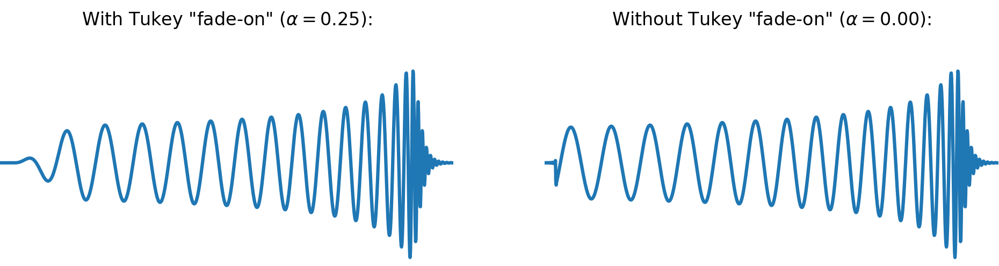

# generate-gw-data

The purpose of this repository is to provide a starting point for generating—more of less—realistic samples of synthetic gravitational wave (GW) data which can be used, e.g., for machine learning experiments. By "samples", we mean time series data, which either does or does not contain a GW waveform. Since the latter have to be simulated, only samples with signals from gravitational waves originating from binary mergers can be created.

In short (for details, see below), the main idea behind the data generating process is the following: 

1. Randomly select a piece of real LIGO recording to serve as background noise, 
2. Randomly select the parameters of a compact binary coalescence (CBC) from a given parameter space and simulate the corresponding waveform,
3. Add ("inject") this simulated waveform into the background noise.

The scripts in this repository are essentially just a convenience wrapper around the [PyCBC software package](https://pycbc.org/), which itself relies partly on the [LIGO Algorithm Library (LAL)](https://wiki.ligo.org/Computing/DASWG/LALSuite).


## 0. Motivation: Who is this for?

(To be added)


## 1. Getting Started

In this section, we describe the necessary steps to get the scripts running and to generate your first samples (don't worry, it's not that complicated!). More details on sample generation process can be found in the sections below. But now let's get started:

### 1.1 Setting up the environment

In order to be able to run the scripts in this repository, you need to make sure you have the necessary packages installed. If you are using `pip` to manage your Python installation, you can simply run:

```
pip install -r requirements.txt
```

We would advise you to install these packages in a new, separate *virtual environment*. If you don't know how to do that, maybe check out the [tutorial on virtualenv on the Hitchhiker's Guide to Python](https://docs.python-guide.org/dev/virtualenvs/#lower-level-virtualenv.).

**Please note:** Since `pycbc` is only available for Python 2.7 (apparently due to some hard-to-migrate dependencies), all code in this repository is written only for Python 2.7 — sorry about that!

### 1.2 Downloading the LIGO recordings

As a next step, you will need to download the LIGO recordings, which will be used for the background noise from the [LIGO Open Science Center (LOSC)](https://www.gw-openscience.org/archive/O1/). We recommend you to download the data at a sampling frequency of 4096 Hz. As the file format, choose HDF5. LOSC also has [a tutorial on downloading data](https://www.gw-openscience.org/tutorial01/), which is a bit out of date, but may be still of use.

To help you get started with the batch download, the `scripts` directory contains a script `download_losc_data.py`, which you can use as follows:

```shell
python download_losc_data.py --destination=/path/to/download/folder
```

At the time of writing of this guide, only the data for Observation Run 1 (O1) has been released to the public. Some of the default values of the download script (e.g., the start and end time stamps) are also based on O1. However, unless the file format is changed significantly for future releases, most of this code should be reusable for O2 with only minor edits.

The download script will automatically create folders for the two detectors  `H1` and `L1` in the specified target directory, and will sort the files accordingly. Due to different downtimes for the detectors, the number of HDF files ending up in these two directories is *not* expected to be the same!

Note that `download_losc_data.py` also has a `--dry` option, in case you want to check what the script *would* download without actually downloading anything yet. Furthermore, if you are actually interested in what is inside such an HDF file, you may want to take a look at the [What's in a LIGO data file?](https://www.gw-openscience.org/tutorial02/) tutorial on LOSC, which explains the internal structure of these files and how to extract data yourself. 

**A word of warning:** The full LIGO recordings for O1 are about ~361 GB worth of HDF files, so be sure you have enough storage! Also, depending on your internet connection, the download will probably take several hours.

### 1.3 Creating your first samples

Once you have set up the Python environment and downloaded the raw LIGO files, you can start doing what is the main purpose of this repository: Create your own artificial gravitational wave data!

To this end, check out the `config_files` directory. In there, you will find two different types of configuration files (see below for a more detailed explanation of the parameters you can configure here!):

* `*.json` files: These files steer the sample generation process itself. Here, you can control how many data samples you want to create, how many cores to use for it, which background data to use, et cetera.
  To get started, all you need to do is open the `default.json` file and adjust the `background_data_directory` path to the location to which you downloaded the HDF files in step 1.2.
* `*.ini` files: These files mainly control the process of simulating GW waveforms with PyCBC. Here, you can choose the *waveform approximant* (i.e., the model used for the simulation) or define the parameter space for the mergers (e.g., the masses of the colliding black holes / neutron stars). However, this is also the place where you control the length (in seconds) of the samples that you are generating.
  If you don't (yet) know what all these things mean, you can simply leave the `waveform_params.ini` file untouched for now.

Once you've decided on your configuration (again, to get started, all you really need to do is fix the `background_data_directory ` value in `default.json`!), we are ready to generate the first sample. To do this, switch to the `scripts` directory and run the following:

```shell
python generate_sample.py --config-file=default.json
```

Depending how many samples your are creating (specified in the `*.json` file), this now may take a while. The resulting sample file should eventually be stored in the `output` directory.

Some experience values for reference: Generating 32 samples *with* an injection, and 16 samples *without* an injection (using 4 processes in parallel) took about ~250 seconds on our machine. A significant part of this time, however, is an overhead that is needed for reading in and analyzing the background data in order to find the times from which a valid piece of noise can be selected (see below).

### 1.4 Inspecting the generated samples

As soon as the sample generation process is complete, you can manually inspect the results to get a feel for what they look like. To this end, we have prepared the script `view_samples.py` in the `scripts` directory. You can run it as follows:

```shell
python view_samples.py --hdf-file-path=/path/to/hdf/sample/file --sample-id=N --save-plot=/where/to/save/the/result/plot
```

If you haven't changed the configuration, you don't even need to specify the `--hdf-file-path` option; per default it will use `./output/default.hdf`. 

The `--sample-id` refers to the sample you want to plot. This should be an integer between 0 and `n_injection_samples` + `n_noise_samples`, as specified in the `*.json` configuration file: 
If you choose a value between 0 and `n_injection_samples`, you will get a sample containing an injection; if you choose one between `n_injection_samples` and `n_injection_samples` + `n_noise_samples`, you will get a sample that does not contain an injection (i.e., that is just whitened background noise).

Finally, you should specify the location where you want to store the resulting plot using the `--save-plot` flag. Note that you can always learn more about the possible command line options by running `python view_sample.py —help`.

If everything worked as expected, you should get a result plot that looks something like the following:


*Heureka!* It looks like a gravitational wave! In blue, you can see the whitened strain, that is, the result from adding a simulated signal into real noise and then *whitening* the result. In orange, you can see the raw simulated signal before adding it into the background noise. It has been rescaled to an arbitrary scale to allow a better comparison with the blue curve. We do not expect a perfect match here!

Note also how the detector signal (in orange) is *different* for the two detector (upper and lower panel). This is because the relative position and orientation of the two detectors causes the signal to be detected with a different phase and amplitude, depending on the position of the source in the sky. This dependency is described by the *antenna patterns* of the interferometer — just one of the subleties of generating realistic GW data that the scripts in this repository are taking care of :)

Finally, if you run the `view_sample.py` script for a sample that does not contain an injection, you will of course only get the whitened strain, but not detector signals:


This is it! Now you should know how to use the tools in this repository to generate your own synthetic GW data, combining real LIGO recordings with simulated waveforms to make injections. Keep on reading to learn more about the details of the process and how you can customize things to suit your needs.


## 2. Configuration Files

This section aims to give a more detailed overview of how the configuration files can be used to steer and control the sample generation process, and to explain which options are available.

### 2.1 JSON files

As explained above, the `*.json` configuration files are used to control the sample generation process itself. These configuration files accept the following options:

* `random_seed`: The seed for the random number generator, which ensures the reproducibility of the results. For example, if you want to generate a training and a test data set for your application, it might make sense to have two `*.json` files that use different values for the `random_seed`.

* `background_data_directory`: The path to the directory that contains the "raw" HDF files with the LIGO recordings. The script automatically and recursively searches the subdirectories of the given path for `*.hdf` or `*.h5` files, so if your files are sorted in `/some/path/H1` and `/some/path/L1`, it is sufficient to give `/some/path` as the `background_data_directory`. 

* `dq_bits`: The _Data Quality Bits_ which you want to be set for all LIGO recordings that are selected to be used as background noise. The definitions of these DQ bits [can be found on LOSC](https://www.gw-openscience.org/archive/dataset/O1/). The bits correspond to the first column of the table there. More information about the meaning of the different categories [is also available here](https://www.gw-openscience.org/O1/). 

  > **Example:** Setting `dq_bits: [0, 1, 2, 3]` in the config file means all data that is used to inject waveforms into has to at least pass all quality tests up to `CBC CAT3`. To put it simply: The more `dq_bits` you request, the better your data quality will be, but the less data will be available.

* `inj_bits`: The *Injection Bits* which you want to be set for the data that can be used to inject waveforms into. The meaning of these bits is given in this [table on LOSC](https://www.gw-openscience.org/archive/dataset/O1/). More information about *Hardware Injections* can be found [on this website](https://www.gw-openscience.org/o1_inj/).

  > **Example:** Setting `inj_bits: [0, 1, 2, 4]` in the config file means that the only type of hardware injection that is permitted in the data used for generating samples are *continuous wave injections*.

* `delta_t`: When sampling a piece of LIGO recording to be used as background noise, first of all, a time `t` is generated at random. This time `t` then is called _valid_ when the whole interval `[t - delta_t, t + delta_t]` passes the quality test defined by `dq_bits` and `inj_bits` (and some additional constrains). This interval is then also selected and used for injecting a waveform as well as whitening and bandpassing the result.
  Because the latter corrupts the edges of the sample, `delta_t` should be chosen sufficiently large so that these artifacts can be cropped. As a (somewhat conservative) guideline, choose `delta_t` at least twice as big as your desired sample length: `delta_t` ≥ 2 * `sample_length`.

* `waveform_params_file_name`: The name of the `*.ini` file to be used to this sample generation process.
* `n_injection_samples`: The number of samples containing an injection to be generated.
* `n_noise_samples`: The number of samples *not* containing an injection to be generated (i.e., samples that consists purely of whitened background noise). If you only want to generate samples with waveform signals in them, simply set this value to 0.
* `n_processes`: The number of (parallel) processes to be used for the sample generation process.
* `output_file_name`: The name that will be given to the final HDF file that contains all generated samples (with and without injections). The file ending (`*.hdf` or `*.h5`) should be included here.

### 2.2 INI files

Also as explained before, the `*.ini` files are used primarily to control the process of simulating GW waveforms with PyCBC. Each such files consists of three sections:

* `[variable_args]`: Here you have to declare the names of the parameters whose values will vary between samples. This is mostly the "physics" of the process, that is, the parameters of the coalescence, such as the masses of the compact objects, or the position in the sky. The values for these parameters will be randomly sampled from a probability distribution (see below) for every waveform that is simulated.
* `[static_args]`: These are the fixed parameters which are the same for all samples. This covers basically the technical side, such as the sampling rate, or the waveform model that is used for the simulation.
* `[prior-*]`: These sections are used to define the probability distributions for the parameters declared in `[variable_args]`. More information about the available distributions can be found [in the PyCBC documentation](http://pycbc.org/pycbc/latest/html/pycbc.distributions.html).

In the following, more information about the parameters of each section will be provided.

#### 2.2.1 [variable_args]

As explained above, variable arguments are the parameters that are specific to the particular waveform that is being simulated. They determine the physical aspect of the process, such as the masses and
distance of the binary mergers, or its location in the sky. Variable arguments are sampled at random for every waveform from a joint distribution over the parameter space.

In the following, we list the the variable arguments and their default values:

* `mass1` and `mass2`: The masses of the two black holes for the simulated binary coalescence. The values are given in solar masses, and are per default sampled independently and uniformly at random from the range [10 M~☉~, 80 M~☉~].

* `spin1z` and `spin2z`: The spins of the two black holes (or neutron stars; depending on the chosen waveform model etc.) in the merger. The values are again sampled independently and are per default drawn uniformly from [0, 0.998]. This is because spin-z values too close to 1 can lead to numerical instabilities during the simulation (this also depends a bit on the waveform model).

* `ra`: The *right ascension* is one of the two angles that determine the position of a source in the sky when using the equatorial coordinate system. It is defined as the angular distance of the source's hour circle east of the vernal equinox when measured along the celestial equator, or more simply: the right ascension is the celestial equivalent of terrestrial longitude. Like the longitude, it takes on values in [0, 2π]. The `ra` is sampled randomly, but in conjunction with `dec` (see below).

* `dec`: The *declination* is the other angle determining the sky position of a source. It is defined as the angular distance from the celestial equator (alternatively: from the celestial North pole), measured along the hour circle of the source. Hence it takes on values in [-π/2, π/2] (or [0, π] when using the alternative definition), similar to the latitude in the geographic coordinate system.

  To ensure the sources of the simulated waveforms are distributed isotropically in the sky, `ra` and `dec` are sampled jointly from a uniform distribution over a sphere. One way to do this in practice is to sample *u* and *v* independently and uniformly from [0, 1], and then set `ra` = 2π⋅*u*​ and `dec` = arcsin(1 - 2⋅*v*). However, PyCBC already provides the `uniform_sky` distribution to sample `ra` and `dec` jointly.

* `polarization`: This is the polarization angle, which is one of the three Euler angles that relate the radiation frame, which is the reference frame in which the gravitational wave propagates in the *z*-direction, to the reference frame of the detector. It is sampled uniformly at random in [0, 2π].

* `coa_phase`: To understand the significance of this angle, one needs to introduce a third reference frame beside the detector and radiation frame, namely, the reference frame of the source itself. In the case of a binary coalescence, this source reference frame is chosen such that its *z*-axis is perpendicular to the plane in which the two black holes (or neutron stars) orbit each other. Then, the `coa_phase` is one of the two angles that specify the location in the sky of the detector as seen from this source frame. Its value is chosen uniformly at random from [0, 2π].

* `inclination`: This is the other polar angle that, together with the `coa_phase`, defines the location of the detector in the sky as observed from the reference frame of the source. It is sampled randomly from a cosine distribution to ensure that the sky position is isotropically distributed on a sphere (cf. how the `ra` and `dec` parameters are sampled) and takes on values between [0, π].

  > **Note:** Neither the `coa_phase` nor the `inclination` have a significant effect on the simulation result unless precessing or higher-order waveforms are considered; they just scale the signal-to-noise ratio (SNR).

* `injection_snr`: This is the network signal-to-noise ratio with which the simulated waveform should later be observed when it is injected into the background noise. It is not directly a parameter for the waveform generation (i.e., it is not passed to any of the PyCBC simulation routines); however, its value is also randomly generated for each waveform. Per default, the injection SNR is sampled uniformly from [5, 20].

#### 2.2.2 [static_args]

As mentioned before, *static arguments* are the global parameters for the waveform simulation, that is, they are the same for all waveforms. They do not contain any information about the physical system that generates the GW signal, but specify the technical aspects of the simulation process.

In the following, we list the the static arguments and their default values:

* `approximant`: The waveform model to be used. There exists a wide range of such waveform models. The default that was chosen here is `SEOBNRv4`, a state-of-the-art approximant that is suitable for simulating spinning, non-precessing binary black holes by using a time-domain effective-one-body (EOB) model (see [Bohé et al, 2017](https://doi.org/10.1103/PhysRevD.95.044028)).

  > **Note:** Using only a single approximant for training a ML model can involve some risk of overfitting to that particular approximant. If this is a concern for you, you may want to consider generating multiple samples with different values for the `approximant`, and then manually mix the results to build your training / testing set.

* `domain`: For some approximants, two versions exist: One in the time- and one in the frequency domain. This parameter resolves this ambiguity.

* `distance`: The distance between the Earth and the source. This parameter must be specified for the simulation. It is, however, rather irrelevant for the sample generation process, because the distance only acts as a scaling factor on the waveform amplitude, and the simulated waveforms are later rescaled again to a match a given network SNR, which is a much more meaningful quantity than the distance. For this reason, a fixed value of 100 Mpc is used for the distance.

* `f_lower`: The frequency at which to begin the simulation of the waveform. The lower this frequency is chosen, the longer the resulting waveform, and also the simulation time. Since the LIGO detectors are not sensitive to signals below ~20 Hz, it does not make sense to choose a value much lower than that. Per default, the value for `f_lower` is of 18 Hz.

* `waveform_length`: Not to be confused with the  `sample_length`, this parameter specifies the length (in seconds) up to which waveforms are simulated, or—if the simulation result is shorter—are resized by padding them with zeros. The default value of this parameter was set to 128 seconds.

* `original_sampling_rate`: The sampling rate of the LIGO recordings that you downloaded from LOSC (in Hertz). If you followed our recommendation, this value should be 4096.

* `target_sampling_rate`: The sampling rate (or frequency) of the waveforms to be generated. This has to match the sampling rate of the background noise into which the simulated waveform is later injected. When choosing this value, you are essentually trading off the resulting sample size (in terms of memory) against the resolution in time. For technical reasons, the value of `target_sampling_rate` has to be a factor (divisor) of `original_samling_rate`. The default value here is 2048 Hz, for the following reason:

  > **Note:** According to the Nyquist-Shannon sampling theorem, a sampling rate of *N* Hz allows to reconstruct signals with a frequency of up to *N*/2 Hz (Nyquist frequency). Signals from compact binary coalescences (CBCs) are mostly expected in a range of up to a few hundred Hertz, meaning a Nyquist frequency of 1024 Hz should be sufficient for resolving them. Therefore, a value of 2048 Hz was eventually chosen for the `target_sampling_rate` of both the background noise and the waveform simulation. However, if you can computationally afford it, you might also want to experiment with higher values for the `target_sampling_rate`. 

* `delta_t`: The inverse of the sampling rate. It is defined in the configuration file as it needs to be passed explicitly to the simulation routines of PyCBC.

* `delta_f`: The inverse of the waveform length. It is defined in the configuration file as it needs to be passed explicitly to the simulation routines of PyCBC.

* `td_length`: The product of `waveform_length` and `sampling_rate`. It is defined in the configuration file as it needs to be passed explicitly to the simulation routines of PyCBC.

* `fd_length`: Calculated as half the `td_length` plus 1. It is defined in the configuration files as it needs to be passed explicitly to the simulation routines of PyCBC.

* `bandpass_lower`: The cutoff-frequency for the high-pass that is applied after whitening. A value of 20 Hz was chosen. This is slightly higher than `f_lower`, which helps to suppress the non-physical turn-on effects of the simulation.

* `bandpass_upper`: The cutoff-frequency for the low-pass that is applied after whitening. Per default, no low-pass is used for the sample generation. This is realized by choosing `bandpass_upper` equal to `target_sampling_rate`.

* `seconds_before_event`: The number of seconds between the start of the sample and the event time (i.e., peak of the waveform signal) in `H1`. A value of 5.5 was chosen as the default. This defines the location of the coalescence within the sample.

  > **Note:** If you are training a ML model that is sensitive to the absolute position of the injection in the sample, and you want to avoid overfitting, you have essentially two options: 
  >
  > 1. You can generate multiple sample files with different values for `seconds_before_event`, and combine the results manually into your training / test data set.
  > 2. You can turn `seconds_before_event` into a *variable argument*, and specify a probability distribution for it. This will require a few more changes in the code (in particular the `WaveformTools.py` file), but should be mostly straight-forward.

* `seconds_after_event`: The number of seconds between the event time in `H1` and the end of the sample. A value of 2.5 seconds was chosen for the default. Together with `seconds_before_event`, this parameter implicitly defines the `sample_length` (which is simply their sum — in the default case, this is 8 seconds).

* `tukey_alpha`: To reduce any amplitude discontinuities when injecting simulated waveforms into the background noise, there is the option to "fade-on" the amplitude of the waveform by multiplying it with a "one-sided" [Tukey window](https://en.wikipedia.org/wiki/Window_function#Tukey_window). The parameter `tukey_alpha` is passed to the `scipy.signal.tukey` function (as `alpha`; [see here fore more information](https://docs.scipy.org/doc/scipy-1.0.0/reference/generated/scipy.signal.tukey.html)) to control the shape of the Tukey window. It takes on values between 0 and 1, with a default value of 0.25. To disable this fade-on, simple set `tukey_alpha=0`. 

  > **Example:** The effect of "fading on" a waveform using this procedure is also illustrated by the following graphic (compare the start of the two waveforms): 
  >
  > 


## 3. More details

In case you want to get even deeper into the inner workings of this repository, this section is here to help you get started. Maybe the most useful starting point is an overview of the sample generation itself, which is provided by the following flowchart:


In the following, more detailed information about some aspects of the sample generation are provided.


### 3.1 Finding *valid* noise times

In order to find a piece of background recording into which we can inject a simulated waveform, we first need to find a *valid* noise time. What does that exactly mean? Well, a given time *t* is called valid, if a `delta_t` interval around *t* satisfies the following constraints:

* Both detectors `H1` and `L1` have data in that interval
* The entire interval has at least the data quality specified by the `dq_bits`
* The entire interval only contains hardware injections of the types allowed by `inj_bits`
* The interval does not contain any *real* GW events. (For O1, this means GW150914, LVT151012, or GW151226 → their event times are hard-coded in `/generate_gw_data/Constants.py`!) 
* The interval does not span over multiple raw HDF files, i.e., the noise time is at least `delta_t` seconds aways from the edge of the HDF file that contains it. (This restriction is only due to convenience and may be dropped if you adjust the `get_strain_from_hdf_file()` method in `/generate_gw_data/HDFTools.py` accordingly)

The entire functionality for finding and sampling valid noise times is contained in the `NoiseTimeline` class defined in `/generate_gw_data/HDFTools.py`. When an instance of that class is instantiated, `_get_hdf_files()` first collects a list of all the raw LIGO recordings in the given `background_data_directory`. Then, the method `_build_timeline()` loops over these files, reads in the `dq_bits` and `inj_bits` arrays, and combines them all into one big timeline (which also explains why this takes some time). This `timeline` is then used by the `is_valid()` method to check the above conditions for a given `gps_time` and a `delta_t`. The `sample()` method then basically only generates random times between the start and the end of the `timeline` until it finds one that is accepted by `is_valid()`.

