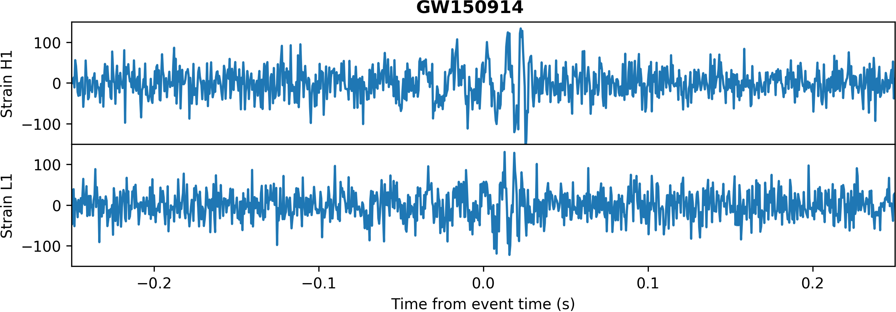

.. _real-events:

Real GW Events
==============

Even when using real LIGO data for the background noise, the sample generation 
procedure in ``generate_sample.py`` will by default make sure that no known
real GW event is ever selected to create a sample.
In practice, however, it may sometimes be useful to also have samples 
including real events that have undergone the same pre-processing steps 
(e.g., whitening, band-passing) as the injection-based samples; for example,
if you want to evaluate the performance of an ML classifier (trained using 
synthetic data) on a real example.

Creating an HDF file with pre-processed real events
---------------------------------------------------

To this end, there exists the script ``create_real_events_file.py``, which
will automatically download the data for every known merger event from GWOSC,
pre-process them in the same way as the routines called by the sample 
generation procedure in ``generate_sample.py``, and save them to an HDF file
in the output directory.
(This means it doesn't require any LIGO data to be downloaded beforehand!)
The only command line argument it takes is ``--ini-config-file``, which
defines the path to the `*.ini` configuration file, whose `static_args` 
section holds the pre-processing parameters to be used (e.g., the limits 
for the band-pass).

The resulting output file will have one group per event (named, for example, 
``GW150914``), with each group containing exactly two data sets: ``h1_strain`` 
and ``l1_strain``.
These hold a (by default 16 second long) time series array of the 
pre-processed strain interval centered around the GW event.

Plotting a real event
---------------------

The script ``plot_real_event.py`` can be used to plot the data in the real
events file.
Running:

.. code-block:: bash

   python plot_real_event.py --event=GW150914 --delta-t=0.25 --hdf-file-path=./output/real_events.hdf

should produce a plot like the following:

